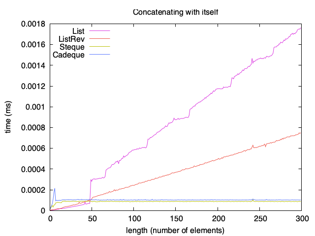

# Verified Purely Functional Catenable Real-Time Deques

This repository serves as a companion to the paper
*Verified Purely Functional Catenable Real-Time Deques*
by
Jules Viennot,
Arthur Wendling,
Armaël Guéneau,
and
François Pottier.

This paper presents OCaml and Rocq implementations of the data structures
presented by
Haim Kaplan
and
Robert E. Tarjan
in the paper
[Purely Functional, Real-Time Deques with Catenation](https://doi.org/10.1145/324133.324139).

## Data Structures

A double-ended queue, also known as a *deque*, is a queue that supports the
four operations *push*, *inject*, *pop*, *eject*.

+ *push* and *pop*
  insert and extract an element at the front end of the queue.
+ *inject* and *eject*
  insert and extract an element at the rear end of the queue.

In addition to these four operations,
*catenable deques* support a concatenation operation,
which expects two deques and produces a deque.

Following Kaplan and Tarjan's paper,
we implement four data structures,
each of which supports a subset of the above five operations.
The following table shows which operations are supported
and indicates their worst-case time complexity:

|         | push | inject |  pop | eject | concat |  rev |         nth         |
| :-----: | :--: | :----: | :--: | :---: | :----: | :--: | :-----------------: |
|  List   | O(1) |   n/a  | O(1) |  n/a  |   n/a  |  n/a |         n/a         |
|  Deque  | O(1) |   O(1) | O(1) |  O(1) |   n/a  | O(1) | O(log(min(i, n-i))) |
| Steque  | O(1) |   O(1) | O(1) |  n/a  |  O(1)  |  n/a |         n/a         |
| Cadeque | O(1) |   O(1) | O(1) |  O(1) |  O(1)  |  n/a |         n/a         |

Each data structure is implemented both in OCaml and in Rocq.
The Rocq implementations are verified.

## Organization

The main directories are as follows:

+ [lib](/lib/) and [src](/src/) contain OCaml code for each data structure.
  More specifically,
  [lib](/lib/) contains an implementation of each data structure,
  while
  [src](/src/) defines the public API of our OCaml package.

+ [theory](/theory/) contains Rocq code and proofs of correctness
  for each data structure.

+ [test](/test/) contains some tests of the OCaml code.
  They are executed by the command `dune test`.

+ [bench](/bench/) contains benchmarks
  where each data structure is compared against a list.
  For example, here is the result of a benchmark
  where the operation of appending a sequence with itself
  is repeated 1000 times:
  
